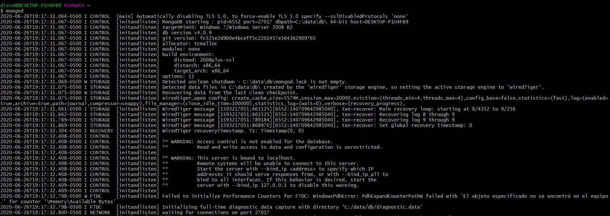
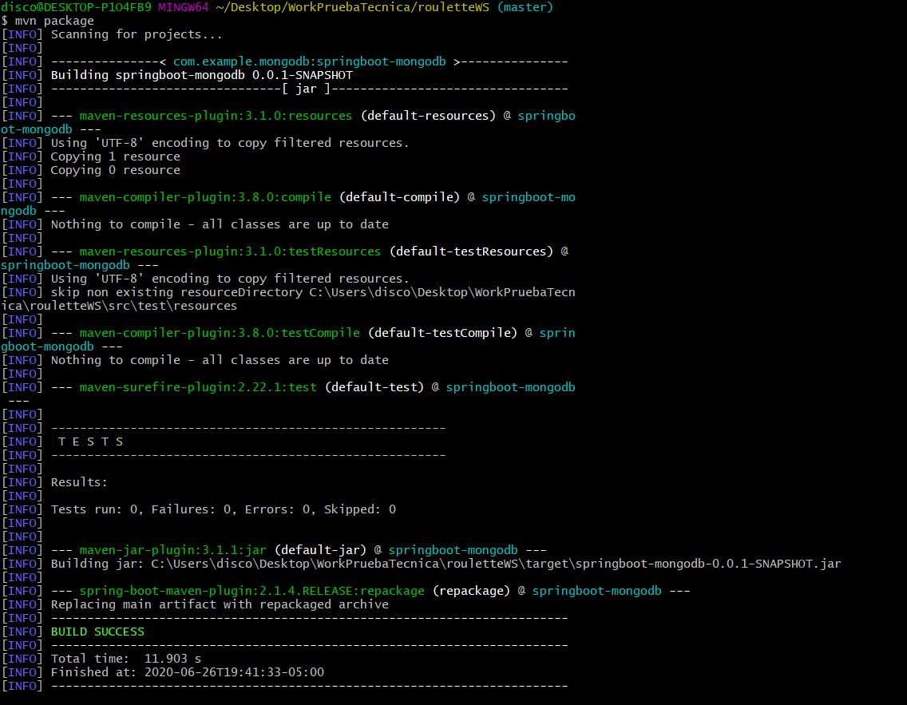
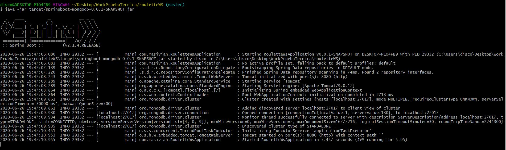
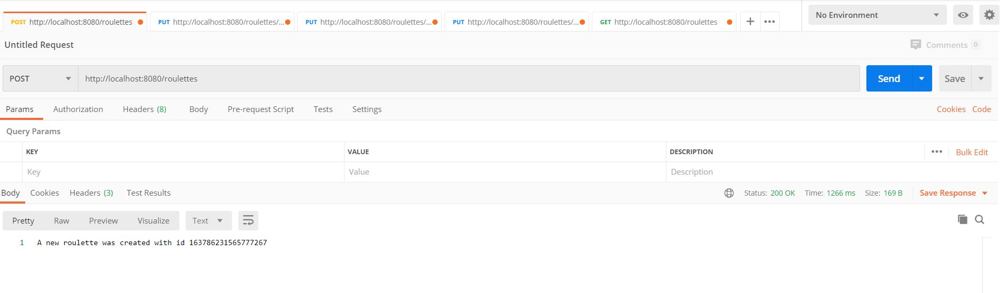
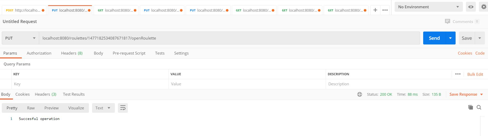
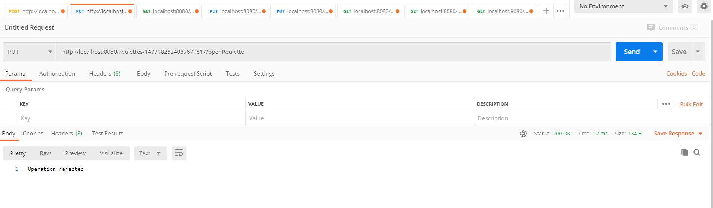

# CleanCodeTest Masivian

Autor: Daniel Quintero

## Introducción

Para cumplir con la prueba técnica construí una API Web RESTful con Spring Boot y MongoDB.

## Prerrequisitos

Los servicios REST están desarrollados en Spring Boot y se conecta a base de datos MongoDB.
  - Se debe tener instalado Mongo para iniciar servidor de base de datos.
  - Se debe tener inslatado Maven para compilar e iniciar Spring Boot Application.

## Instrucciones

1. Clonar el repositorio:

        git clone https://github.com/danielq97/CleanCodeTest.git

      
2. Desde una terminal iniciar el servidor de Mongo, en Windows:

        mongod
      
   En Linux:
   
        sudo systemctl start mongodb
        
   Una vez iniciado el servidor de Mongo nos debera aparecer algo como esto en la terminal:

   Ahora debemos iniciar la Spring Boot Application. Para ello necesitamos construir el jar de la aplicación, mediante Maven. Una vez construido el jar lo podemos ejecutar. 

4. Construir el jar de la aplicación. Desde la terminal accedemos al repositorio clonado:

        mvn package

   Una vez construido el jar de la aplicación nos saldrá algo como esto:
   
   

5. Ejecutar el jar de la aplicación:

        java -jar target/springboot-mongodb-0.0.1-SNAPSHOT.jar
        
   Una vez ejecutado el jar nos saldrá algo como esto:  
   
    
        
   Ahora ya estamos preparados para probar los Endpoints.        
## Endpoints

Construí 5 Endpoints, están en el orden que se enunciaron en la prueba:

- /roulettes                                 POST
- /roulettes/{id}/openRoulette               PUT
- /roulettes/{idRoulette}/{bet}/{value}      PUT
- /roulettes/{idRoulette}/closeRoulette      PUT
- /roulettes                                 GET

Se procede a probar mediante Postman. Recordar poner el método de petición correcto.
### Primer Endpoint 

- /roulettes  POST

Endpoint que permite la creación de una nueva ruleta. No necesita ningún input. Devuelve id de la rouleta creada.

Ejemplo para probar en Postman (colocar verbo POST):

      http://localhost:8080/roulettes

 

 ### Segundo Endpoint 
 
 - /roulettes/{id}/openRoulette PUT
 
 Endpoint de apertura de ruleta. Recibe de input el id de una ruleta. Devuelve un mensaje que confirme que la operación fue éxitosa o denegada. Después de realizar este request se permite peticiones de apuestas. Para probar escogere el id de la ruleta anteriormente creada, 1477182534087671817
 
 Ejemplo para probar en Postman (colocar verbo PUT y id de una ruleta creada anteriormente):
 
      http://localhost:8080/roulettes/{id}/openRoulette
      
       
  
  Si probamos una vez la operación será rechazada, ya que la ruleta está abierta.
  
        
