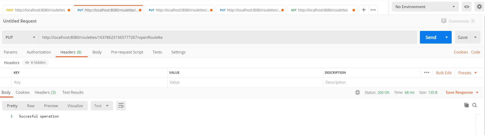
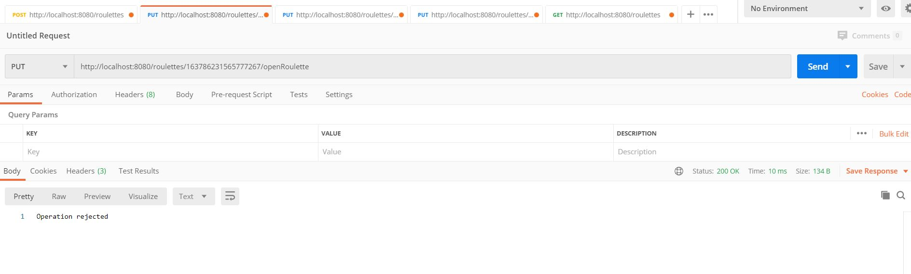
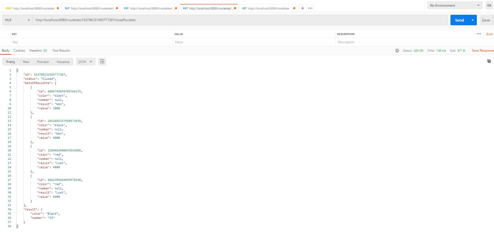

# CleanCodeTest Masivian

Autor: Daniel Quintero

## Introducción

Para cumplir con la prueba técnica construí una API Web RESTful con Spring Boot y MongoDB.

## Prerrequisitos

Los servicios REST están desarrollados en Spring Boot y se conecta a base de datos MongoDB.
  - Se debe tener instalado Mongo para iniciar servidor de base de datos.
  - Se debe tener inslatado Maven para compilar e iniciar Spring Boot Application.
  
## Recomendaciones

- La Spring Boot Aplication corre por el puerto 8080 por defecto y Mongo corre por el puerto 27017 por defecto, si en esos puertos hay corriendo otros servicios, para probar todo hay que detenerlos.
- La solución está desarrollada en un proyecto Maven. Para visualizar el código se recomienda STS (Spring Tool Suite) o IntelliJ IDEA.

## Instrucciones

1. Clonar el repositorio:

        git clone https://github.com/danielq97/CleanCodeTest.git

      
2. Desde una terminal iniciar el servidor de Mongo, en Windows:

        mongod
      
   En Linux:
   
        sudo systemctl start mongodb
        
   Una vez iniciado el servidor de Mongo nos debera aparecer algo como esto en la terminal (mi terminal es Git Bash desde Windows):

   Ahora debemos iniciar la Spring Boot Application. Para ello necesitamos construir el jar de la aplicación, mediante Maven. Una vez construido el jar lo podemos ejecutar. 

4. Construir el jar de la aplicación. Desde la terminal accedemos al repositorio clonado:

        mvn package

   Una vez construido el jar de la aplicación nos saldrá algo como esto:
   
   

5. Ejecutar el jar de la aplicación:

        java -jar target/springboot-mongodb-0.0.1-SNAPSHOT.jar
        
   Una vez ejecutado el jar nos saldrá algo como esto:  
   
    
        
   Ahora ya estamos preparados para probar los Endpoints.        
## Endpoints

Construí 5 Endpoints, están en el orden que se enunciaron en la prueba:

- /roulettes                                 POST
- /roulettes/{rouletteId}/openRoulette       PUT
- /roulettes/{rouletteId}/{bet}/{value}      PUT
- /roulettes/{rouletteId}/closeRoulette      PUT
- /roulettes                                 GET

Se procede a probar mediante Postman. Recordar poner el método de petición correcto.
### Primer Endpoint 

- /roulettes  POST

Endpoint que permite la creación de una nueva ruleta. No necesita ningún input. Devuelve el id de la rouleta creada. Con este endpoint se crea la colección Roulette en base de datos.

Para probar en Postman (colocar verbo POST):

      http://localhost:8080/roulettes

 

### Segundo Endpoint 
 
 - /roulettes/{rouletteId}/openRoulette PUT
 
Endpoint de apertura de ruleta. Recibe de input el id de una ruleta. Devuelve un mensaje que confirme que la operación fue éxitosa o denegada. Después de realizar este request se permite peticiones de apuestas. Para probar escogeré el id de la ruleta anteriormente creada, 163786231565777267
 
Para probar en Postman (colocar verbo PUT y id de una ruleta creada anteriormente):
 
      http://localhost:8080/roulettes/{rouletteId}/openRoulette
      
Ejemplo:

      http://localhost:8080/roulettes/163786231565777267/openRoulette

       
  
  Si probamos una vez la operación será rechazada, ya que la ruleta está abierta.
  
      
  
### Tercer Endpoint
  
  - /roulettes/{rouletteId}/{bet}/{value} PUT
  
Endpoint de apuesta a ruleta. Se puede apostar un número (del 0 al 36) o color (red or black) y un valor de apuesta (máximo 10000 dólares). Recibe de inputs, el id de la ruleta, la apuesta (ya sea color o número), y  el valor de la apuesta. En los HEADERS se pasa un id de usuario, el servicio que haga la petición ya realizó autenticación y validación de que el cliente tiene el crédito neceario para realizar la apuesta.Para probar escogeré la ruleta creada, id 163786231565777267, color black, valor 2000.
  
Para probar en Postman (colocar verbo PUT, id de ruleta creada anteriormente, número o color válido y valor de apuesta válido, en la sección de headers de Postman colocar como key userId y como value un número que representa el id de un usuario):

      http://localhost:8080/roulettes/{rouletteId}/{bet}/{value}
      
Ejemplo:

      http://localhost:8080/roulettes/163786231565777267/black/2000
      

   
Si ingresamos parametros de apuesta no válidos, la apuesta no será efectuada:

   
### Cuarto Endpoint
   
   - /roulettes/{rouletteId}/closeRoulette PUT
   
Endpoint de cierre de apuestas de una ruleta. Recibe de input el id de una ruleta. Devuelve el resultado de cada una de las apuestas hechas desde la apertura de la ruleta. Hasta el cierre de esta. Para probar escogeré la ruleta creada, id 163786231565777267 (creé más apuestas previamente).

Para probar en Postman (colocar verbo PUT y id de ruleta creada anteriormente):

       http://localhost:8080/roulettes/{rouletteId}/closeRoulette
       
Ejemplo:

       http://localhost:8080/roulettes/163786231565777267/closeRoulette
       

### Quinto Endpoint

- /roulettes  GET

Endpoint de listado de ruletas creadas con sus estados. No necesita ningún input. Para probar, previamente había creado más ruletas y aperturado algunas.

Para probar en Postman (colocar verbo GET):

        http://localhost:8080/roulettes
        
        

## Dependencias del proyecto

En el pom.xml aparte de utilizar las depencias de ***Spring Web*** y ***MongoDB***, utilicé una de **OpenAPI** (que tiene la configuración el paquete com.masivian.config) que permite generar una documentación sencilla de los Web Services y la deja en el siguiente formato:

## Notas

- No usé ORMs.
- Las variables de configuración que utilicé son para la conexión a la base de datos y esta variables son leídas de variables de entorno que están en el fichero **application.properties** ubicado en **src/main/resources** .
- Investigué sobre CloudWatch y leí que era para monitorear logs y el estado de aplicaciones desplegadas en EC2 o otras herramientas de AWS. 

